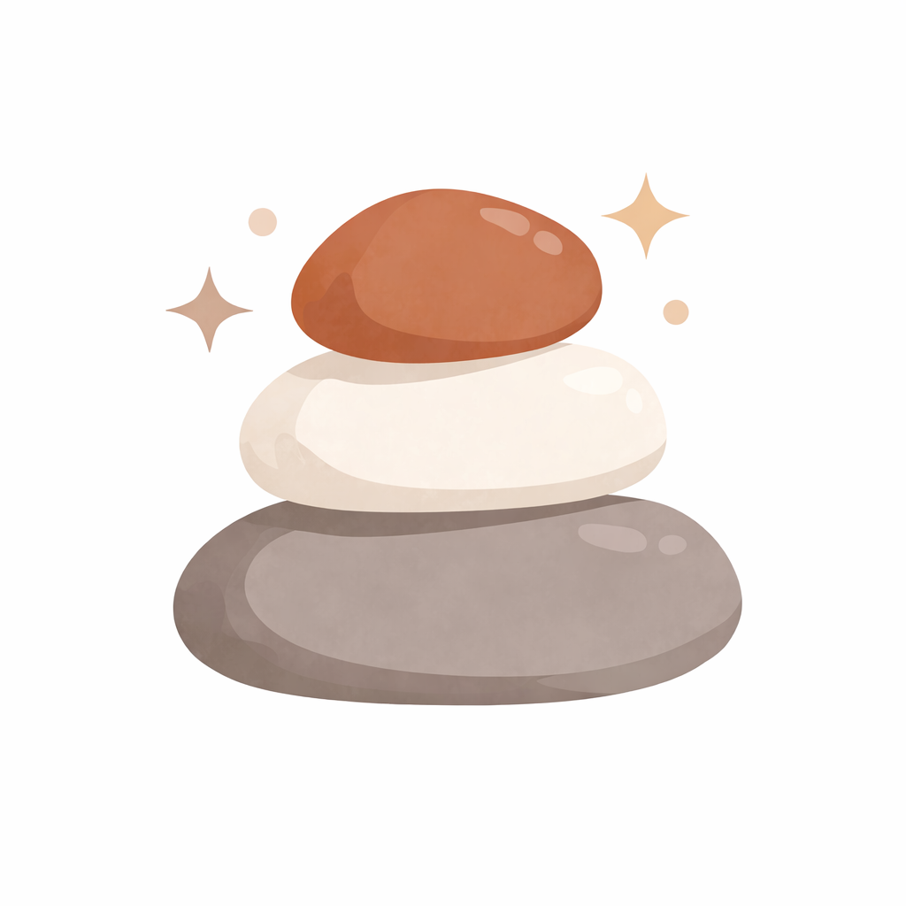

 

 

Frontend Developer with **4 years of experience** building scalable AdTech and SaaS platforms. I focus on clean, maintainable code, intuitive UX, and component-driven architecture - with experience shipping products end-to-end, from internal tools to the App Store.

---

## Tech Stack

<table>
<tr>
<td valign="top">

**Languages & Frameworks**

</td>
<td valign="top">

**State, Data & Styling**

</td>
<td valign="top">

**Tools & Databases**

</td>
</tr>
</table>

---

##  Mira - Reflect & Photo Journal

> Slow down your daily routine and capture life's small, meaningful moments. Complete gentle daily mindful challenges, log your mood, take a photo, and reflect - one day at a time.

